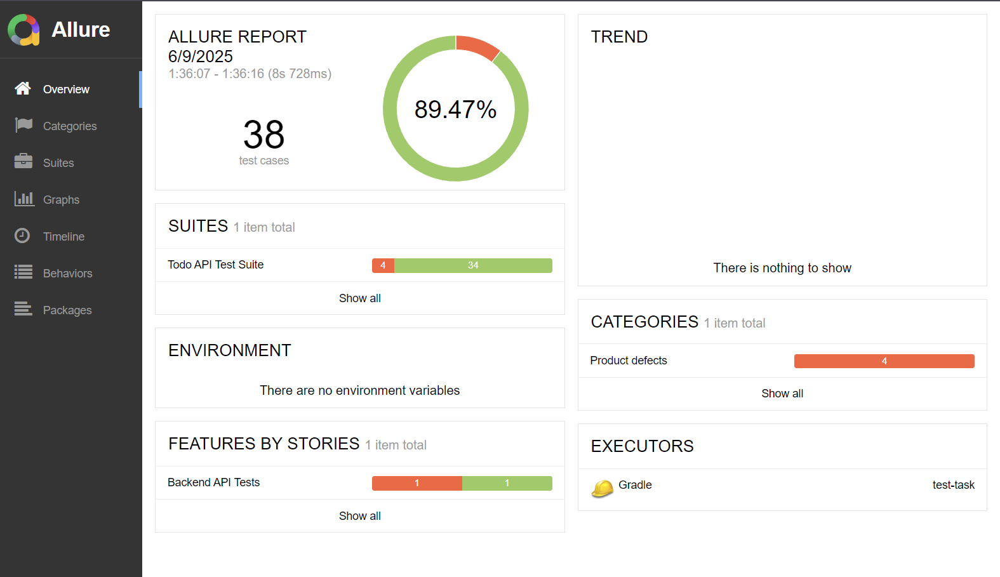
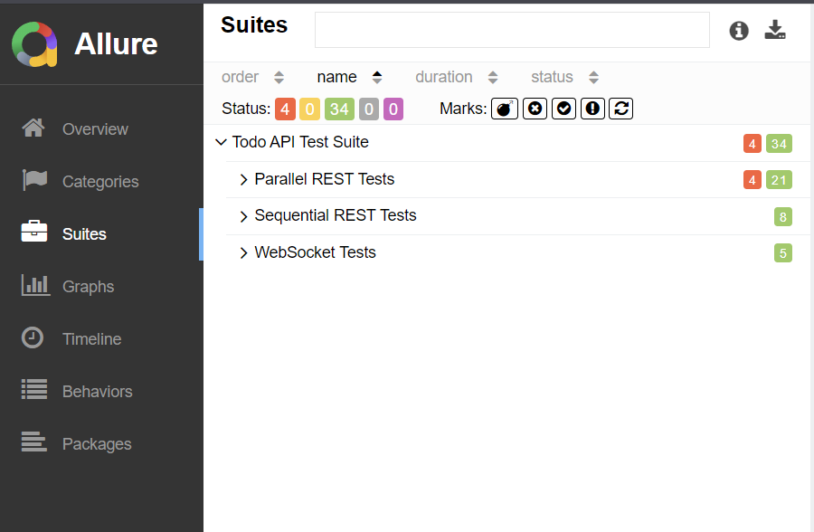
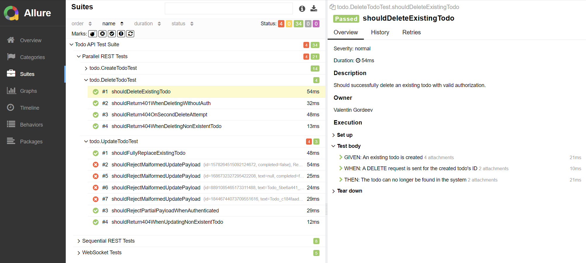
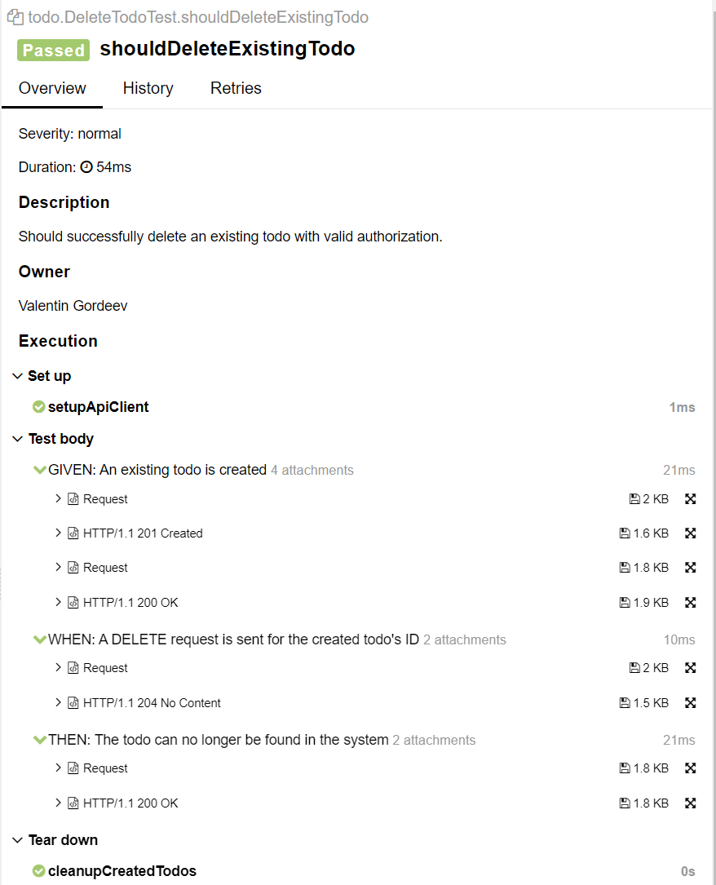
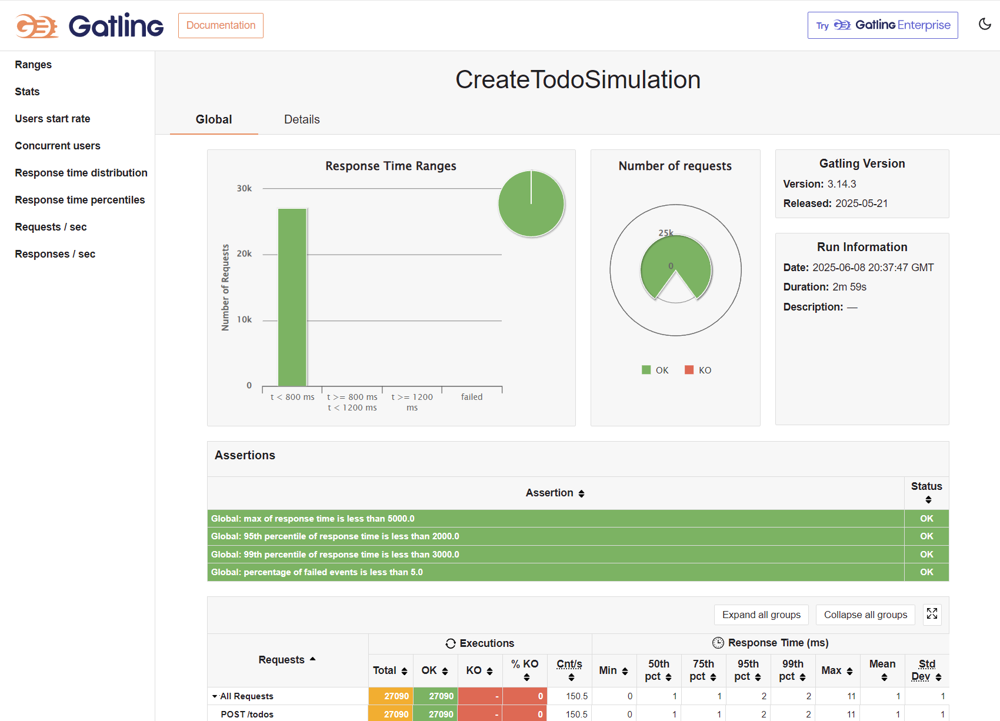
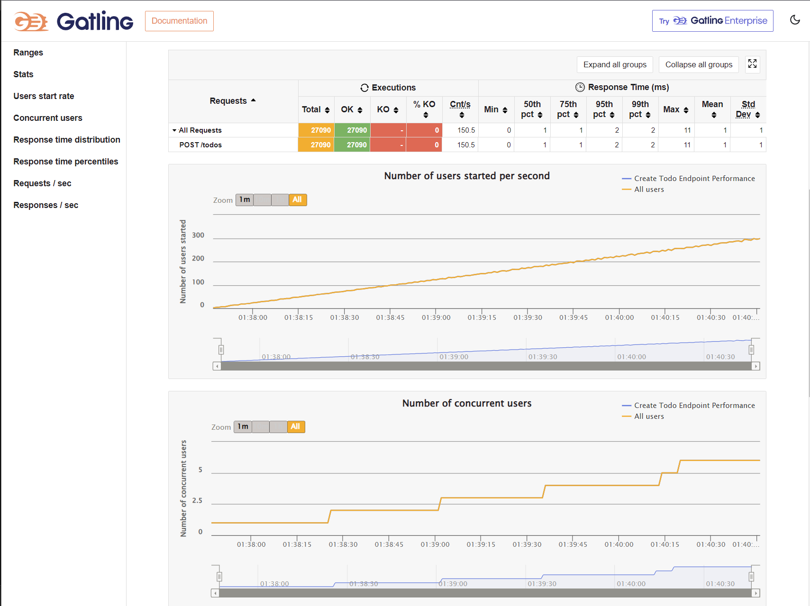
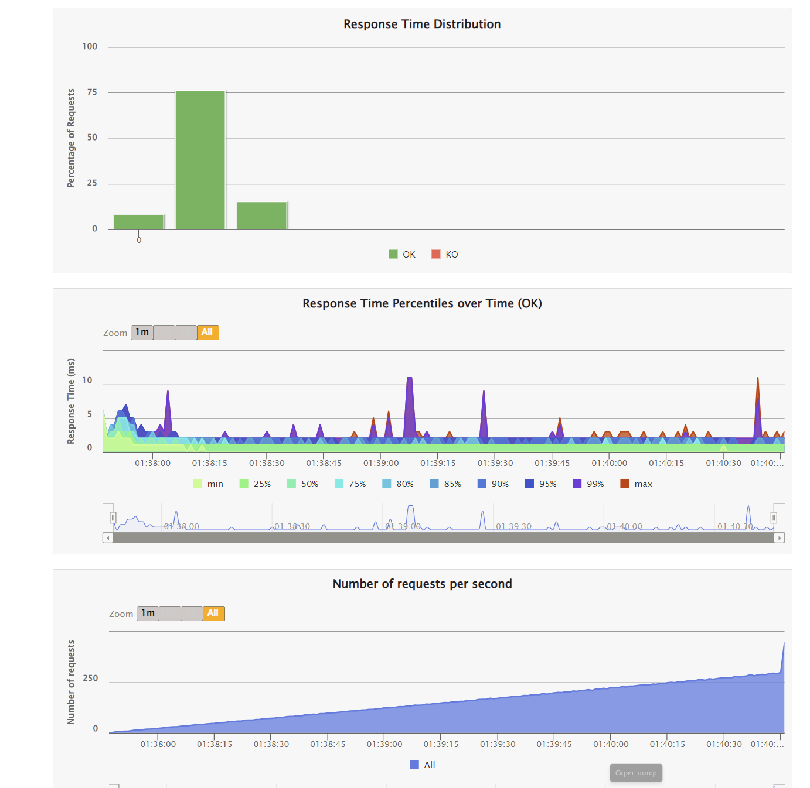
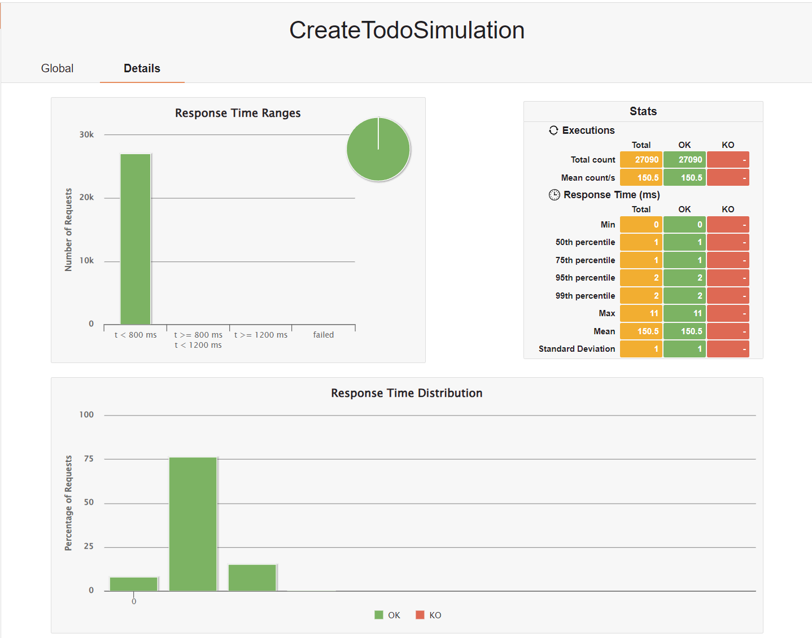
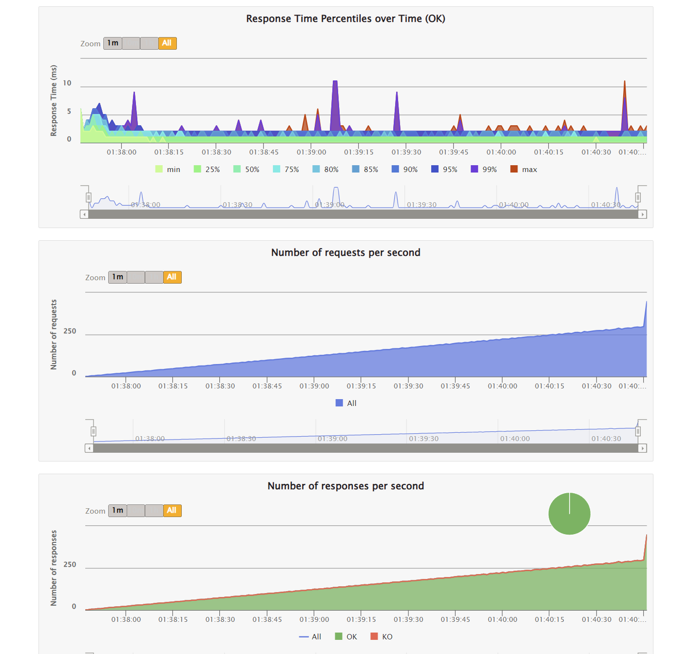

# API Test Automation Framework

A comprehensive test automation framework for validating REST API and WebSocket functionality of a TODO management application, including performance testing capabilities.

## 🏗️ Architecture Overview

The framework follows a layered architecture pattern with clear separation of concerns:

```
├── core/                  # Framework core components
│   ├── api/               # Base API services and providers
│   ├── assertions/        # Custom assertions extending AssertJ
│   ├── config/            # Configuration management (Owner)
│   ├── data/              # Test data generation and builders
│   ├── errors/            # Common error messages
│   ├── helpers/           # Utility classes
│   ├── models/            # POJO classes
│   └── websocket/         # WebSocket base implementation
│
├── todo/                  # TODO-specific implementations
│   ├── api/               # TodoApiService, TodoWebSocketService
│   ├── assertions/        # Domain-specific assertions
│   ├── data/              # TODO test data scenarios
│   └── model/             # Domain models (Todo, TodoNotification)
│
├── tests/                 # Test suites
│   ├── REST API tests     # CRUD operations testing
│   └── WebSocket tests    # Real-time notifications
│
├── performance/           # Gatling performance tests
│   ├── core/              # Base simulation, load profiles
│   └── simulations/       # Concrete test scenarios
│
└── resources/
    ├── schemas/           # JSON Schema validation files
    ├── templates/         # Custom Allure report templates
    └── config/            # Test configuration files
```

### Design Patterns Used

- **Builder Pattern**: Fluent API for test data creation (`ModelBuilder`, `PayloadBuilder`)
- **Registry Pattern**: Centralized service and test data management
- **Factory Pattern**: Load profile generation for performance tests
- **Template Method**: Base classes for common operations
- **Strategy Pattern**: Different load patterns for performance tests

## 🚀 Key Features

### Framework Core
- **Fluent API Design**: Builder pattern for test data, chainable assertions
- **Type-Safe Configuration**: Owner library with environment variable support
- **Generic CRUD Operations**: Base classes for common REST patterns
- **Smart Test Data Generation**: ModelBuilder with Faker integration
- **WebSocket Support**: Thread-safe client with metrics and reconnection
- **Custom Assertions**: Domain-specific assertions for better readability
- **JSON Schema Validation**: Contract testing with schema files
- **Parallel Execution**: TestNG configuration for optimal test distribution

### Test Implementation
- **Comprehensive Coverage**: All CRUD operations + WebSocket notifications
- **Parallel Execution**: Tests grouped for concurrent execution (5 threads)
- **Automatic Cleanup**: Thread-safe cleanup after each test
- **JSON Schema Validation**: Contract testing for API responses
- **Detailed Reporting**: Allure integration with custom templates
- **Performance Testing**: Gatling simulations with multiple load patterns

## 📋 Test Scenarios Coverage

### Functional Tests (REST & WebSocket)

| Endpoint / Feature | Test Case | Status |
|---|---|:---:|
| **POST /todos** | Valid creation & data variations (empty string, symbols) | ✅ |
| | Handles potential SQL injection payloads as literal strings | ✅ |
| | Ignores extra, unrecognized fields in the payload | ✅ |
| | Rejects malformed payloads (missing fields, wrong types, overflow) | ✅ |
| **GET /todos** | Retrieves a complete and correct list of all todos | ✅ |
| | Correctly handles pagination (`limit` & `offset`) | ✅ |
| | Correctly handles boundary cases (empty list, large offset) | ✅ |
| | Rejects requests with invalid pagination parameters (`Invalid query string`) | ✅ |
| **PUT /todos/{id}**| Correctly performs full resource replacement on existing todos | ✅ |
| | Rejects partial payloads for authenticated users (returns 400) | ✅ |
| | Rejects updates for non-existent resources (404) | ✅ |
| | **(BUG)** Rejects malformed payload for **unauthenticated** users | 🐛 |
| **DELETE /todos/{id}**| Successfully deletes a resource with required Basic Auth | ✅ |
| | Correctly handles repeated delete requests (idempotency check) | ✅ |
| | Rejects requests for non-existent resources (404) | ✅ |
| | Rejects requests without valid authorization (401) | ✅ |
| **WebSocket** | Receives real-time notifications for new todos | ✅ |
| | Handles concurrent notifications without data loss | ✅ |
| | Correctly isolates connection state (no "old" messages) | ✅ |
| | Handles notification timeouts gracefully without disconnecting | ✅ |

> **Note:** The test suite includes one intentionally failing test marked with 🐛 to document a known bug. See the **Known Issues** section for details.

### Performance Tests

#### Load Patterns
1. **Smoke Test**: Minimal load (2 RPS for 1 minute)
2. **Normal Load**: Gradual ramp-up (10 RPS for 5 minutes)
3. **Stress Test**: Finding limits (ramp to 300 RPS)
4. **Spike Test**: Traffic burst simulation (10→50→10 RPS)

#### Simulations
- **CreateTodoSimulation**: Isolated POST /todos endpoint testing
- **TodoUserJourneySimulation**: Complete user workflow (Create→Verify→Update→Delete)

## 🛠️ Technical Stack

- **Java 17** - Language version
- **TestNG** - Test framework with parallel execution support
- **REST Assured** - API testing library
- **Gatling** - Performance testing framework
- **Allure** - Test reporting with custom templates
- **AssertJ** - Fluent assertions
- **Owner** - Configuration management
- **Lombok** - Boilerplate reduction
- **Jackson** - JSON processing
- **Java-WebSocket** - WebSocket client
- **JSON Schema Validator** - Contract validation

## 📊 Test Results

### Functional Test Report (Allure)
 




### Performance Test Results (Gatling)






## 🚦 Running Tests

### Prerequisites
```bash
# Run the application with verbose logging
docker load -i [image_name.tar]
docker run -p 8080:4242 -e VERBOSE=1 [image_name]
```

### Functional Tests
```bash
# Run all tests
./gradlew clean test

# Run specific test group
./gradlew clean test -Dgroups=rest
./gradlew clean test -Dgroups=websocket
./gradlew clean test -Dgroups=sequential

# Generate Allure report (after tests)
./gradlew allureReport
./gradlew allureServe
```

### Performance Tests
```bash
# Run with default profile (smoke)
./gradlew gatlingRun

# Run with specific profile
./gradlew gatlingRun -Dperformance.profile=stress
./gradlew gatlingRun -Dperformance.profile=spike

# Then choose a simulation (press 0 or 1 and ENTER)
Choose a simulation number:
     [0] simulations.CreateTodoSimulation
     [1] simulations.TodoUserJourneySimulation
```
Gatling reports are generated in build/reports/gatling/. A link to the report will be printed in the console upon completion.

## 🔧 Configuration

Configuration is managed through `config.properties` with environment variable override support:

```properties
# API Configuration
base.uri=http://localhost
base.port=8080

# WebSocket Configuration  
websocket.uri=ws://localhost:8080/ws
websocket.connection.timeout.seconds=10

# Authentication (sensitive data! But for test purposes I left it here)
admin.username=admin
admin.password=admin

# Performance profiles (default)
performance.profile=smoke
```

Override via environment variables:
```bash
export BASE_URI=http://todo-api.example.com
export BASE_PORT=443
export PERFORMANCE_PROFILE=stress
```

## 🔍 Notable Implementation Details

1. **No Direct GET by ID**: The API lacks `GET /todos/:id`, so we search through the full list
2. **Auth Required for DELETE**: Basic authentication with admin:admin credentials
3. **WebSocket Notifications**: Only for new todos (type: "new_todo")
4. **Test Isolation**: Each test manages its own cleanup via thread-safe queue
5. **ID Generation**: Performance tests use thread-local ID generators to avoid collisions
6. **Parallel Execution**: Tests are grouped for optimal parallel execution:
    - Sequential group: Tests requiring ordered execution
    - Parallel group: Independent tests running with 5 threads
7. **Custom Allure Templates**: Enhanced request/response formatting in reports

## 🐛 Known Issues

1.  **BUG-1: Incorrect Authorization Requirement on `PUT /todos/{id}`**
   - **Specification:** The provided `task.md` explicitly states that only the `DELETE /todos/:id` endpoint requires `Authorization`. Consequently, the `PUT` endpoint should be accessible without authentication.
   - **Observed Behavior:** The API incorrectly demands authentication for `PUT` requests when the payload is invalid. If a request has a malformed or partial payload and lacks an `Authorization` header, the API returns `401 Unauthorized` instead of the expected `400 Bad Request`.
   - **Impact:** This behavior directly contradicts the provided specification, leading to unexpected errors for unauthenticated clients and making the API difficult to use correctly.
   - **Tracking:** A dedicated test, `shouldRejectMalformedUpdatePayload`, is included to document this specification deviation. It is designed to fail until the API's authorization logic is corrected.

## 📝 Future Test Cases (Checklist)

### Additional REST API Tests
- [ ] Test todo text with maximum length
- [ ] Test concurrent updates to same todo
- [ ] Test rate limiting behavior (if there is one)
- [ ] Test CORS headers
- [ ] Test content negotiation
- [ ] Test with different character encodings

### WebSocket Enhancements
- [ ] Test maximum connection limits
- [ ] Test binary message handling
- [ ] Test connection timeout scenarios
- [ ] Test multiple simultaneous connections

### Performance Scenarios
- [ ] Endurance test (24+ hours)
- [ ] Volume test (large payloads)
- [ ] Concurrent user sessions
- [ ] Database connection pool exhaustion (if there will be DB)
- [ ] Memory leak detection
- [ ] Network latency simulation
- [ ] Graceful degradation testing

## 💬 Questions & Feedback

Thank you for reviewing this test automation framework. If you have any questions or need clarification on any aspect of the implementation, please feel free to reach out!